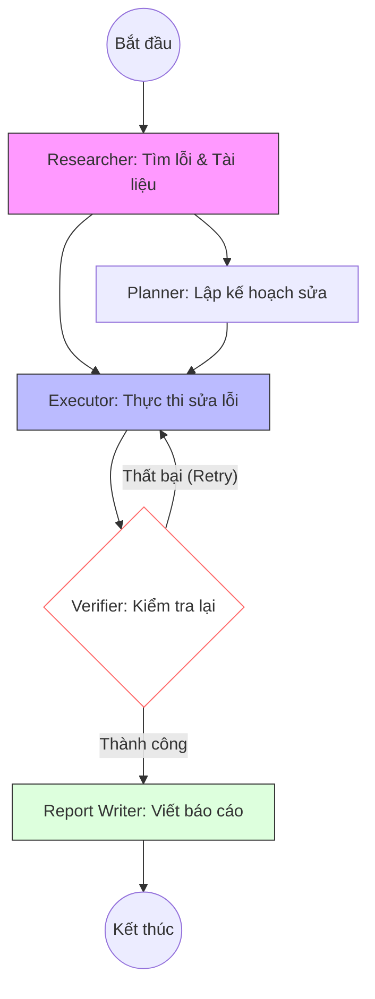

# Tổng quan về dự án AWS Drift Multi-Agent Analyzer (Dành cho người mới)

Tài liệu này giải thích các khái niệm cơ bản và hướng dẫn vận hành dự án AWS Drift Multi-Agent Analyzer.

---

## 1. Các khái niệm nền tảng

### AWS (Amazon Web Services) & Cloud
**Cloud** đơn giản là việc "thuê máy tính/tài nguyên của Amazon thông qua Internet". Bạn không cần mua máy vật lý, chỉ cần thuê và trả tiền theo mức sử dụng.

### Khái niệm "Drift" (Trôi dạt)
Khi bạn dùng code (**CloudFormation**) để thiết kế hạ tầng (ví dụ: tạo 1 máy ảo), nhưng sau đó ai đó lại vào web AWS để sửa thủ công (ví dụ: đổi tên máy ảo) mà không cập nhật lại code. Sự sai lệch giữa **Thiết kế (Code)** và **Thực tế (AWS)** gọi là **Drift**. AWS Drift Multi-Agent Analyzer ra đời để giải quyết vấn đề này.

---

## 2. Các chế độ hoạt động (Operating Modes)
Hệ thống cung cấp 3 chế độ linh hoạt để quản lý Drift:

1.  **Ask Mode (Kiểm tra)**: Truy vấn nhanh trạng thái của hạ tầng (Thời gian tạo, cập nhật lần cuối, trạng thái hiện tại).
2.  **Classification Mode (Phân tích)**: AI phân tích mức độ nghiêm trọng của Drift (Thấp/Cao), tìm nguyên nhân gốc rễ và đề xuất hướng xử lý.
3.  **Agent Mode (Tự động sửa lỗi)**: Chế độ mạnh mẽ nhất. Đội ngũ AI Agent sẽ tự động lập kế hoạch, thực thi việc sửa lỗi và kiểm chứng kết quả mà không cần can thiệp thủ công.

---

## 3. Các công nghệ sử dụng
*   **AWS Bedrock**: Nền tảng cung cấp các bộ não AI (Claude 3.5 Sonnet).
*   **Strands Framework**: Thư viện Python dùng để xây dựng logic phối hợp giữa các Agent.
*   **SearXNG**: Công cụ tìm kiếm mã nguồn mở (tự host) giúp AI tra cứu tài liệu AWS chính xác.
*   **SQLite**: Cơ sở dữ liệu lưu trữ lịch sử trò chuyện cục bộ.
*   **TypeScript/React**: Xây dựng giao diện Extension trên VS Code.

---

## 4. Đội ngũ AI Agent (Bộ não hệ thống)
Hệ thống chia thành 5 chuyên gia phối hợp:

1.  **Researcher**: Soi lỗi thực tế trên AWS và tra cứu tài liệu hướng dẫn sửa lỗi.
2.  **Planner**: Vạch ra các bước sửa lỗi chi tiết và an toàn (có phương án rollback).
3.  **Executor**: Trực tiếp gọi lệnh AWS để sửa lại hạ tầng.
4.  **Verifier**: Kiểm tra độc lập xem lỗi đã thực sự hết chưa. Nếu chưa, nó bắt Executor làm lại.
5.  **Report Writer**: Tổng kết toàn bộ quá trình thành báo cáo chuyên nghiệp.

---

## 5. Quy trình làm việc (Multi-Agent Workflow)

Dưới đây là sơ đồ phối hợp giữa các Agent trong **Agent Mode**:



---

## 6. Cơ chế Tool Calling (AI "Hành động")
AI không chỉ nói suông, nó có thể "cầm búa" thông qua các công cụ:
*   **`use_aws`**: Công cụ vạn năng để tương tác với mọi tài nguyên Cloud (xem, sửa, xóa).
*   **`search_aws_docs`**: Giúp AI tự tra cứu tài liệu hướng dẫn của Amazon qua SearXNG.

---

## 7. Cơ chế Giao tiếp (The Bridge)
Làm sao Extension điều khiển được AI?

1.  **Logic (Backend)**: Định nghĩa trong `agentcore/main.py` (sử dụng Strands). Logic này được đóng gói và triển khai lên **AWS Bedrock Agent**.
2.  **Giao diện (Frontend)**: Extension gửi tin nhắn kèm các Metadata (Session ID) lên Bedrock qua AWS SDK.
3.  **Kết nối**: Bedrock nhận lệnh, chạy logic Agent và trả kết quả về Extension theo dạng **Stream** (chữ hiện ra đến đâu thấy đến đó).

---

## 8. Các tính năng mở rộng
*   **Quản lý hội thoại (CRUD)**: Người dùng có thể tạo nhiều phiên chat, đổi tên hoặc xoá lịch sử cũ để quản lý các đầu việc khác nhau.
*   **Thông báo hàng ngày**: Hệ thống có khả năng gửi báo cáo tình trạng Drift định kỳ để bạn luôn làm chủ hạ tầng.
*   **Rich UI**: Hiển thị code, bảng biểu so sánh và các icon trạng thái trực quan trong VS Code.

---

## 9. Hướng dẫn chạy thử dự án (Quick Start)

> [!WARNING]
> **Bảo mật**: Tuyệt đối không lưu Access Key trực tiếp vào code hoặc chia sẻ file này khi có chứa Key thật.

### Bước 1: Chuẩn bị môi trường
1.  **Python**: Yêu cầu phiên bản **3.12** trở lên.
2.  **Cài đặt thư viện**:
    ```bash
    pip install strands requests boto3 bedrock-agentcore-starter-toolkit
    ```
3.  **SearXNG**: Đảm bảo SearXNG đang chạy tại `http://localhost:8080`. (Khuyên dùng Docker: `docker run -d -p 8080:8080 searxng/searxng`)

### Bước 2: Cấu hình AWS
Chạy lệnh bên dưới và nhập thông tin từ tài khoản AWS của bạn:
```bash
aws configure
```
*   `AWS Access Key ID`: (Nhập từ IAM Console)
*   `AWS Secret Access Key`: (Nhập từ IAM Console)
*   `Default region name`: `ap-southeast-1` (hoặc region bạn sử dụng)

### Bước 3: Chạy Backend (Local Test)
```bash
cd agentcore
python main.py
```

### Bước 4: Chạy Extension
1.  Mở thư mục `extension`, chạy `npm install`.
2.  Nhấn **F5** để mở cửa sổ Extension Development Host.
3.  Mở View **Drift Analyzer** để bắt đầu trải nghiệm 3 chế độ: **Ask, Classification, Agent**.
